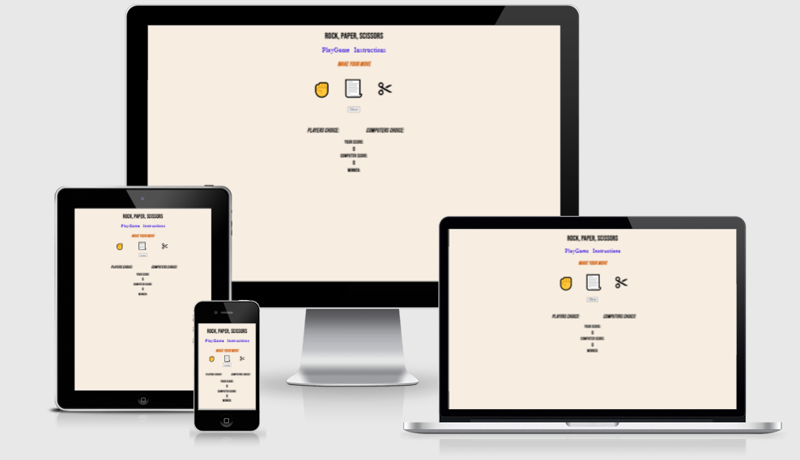
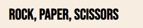
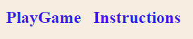
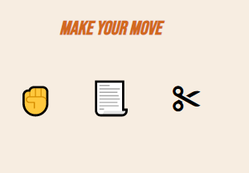
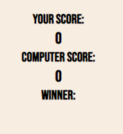
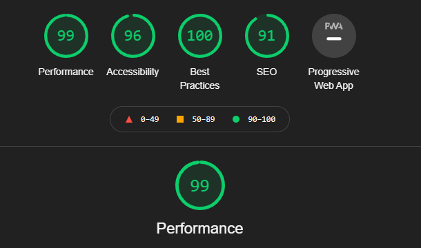

# Rock Paper and Scissors

Rock Paper and Scissors is a JavaScript based game where the player and the computer each make a choice. The Computer picks completely a random selection and depending on the choice of the player either the computer or player will win. The game will issue a message that states you win or you better luck next time. 

This game site contains two menu options, PlayGame and Instructions. This is simply a fun and quick game targeted at adults or children of all ages.  

## Features

Header 

    * The header contains the name of the game "Rock, Paper, Scissors" using the simple color black, 'Bebas Neue' font, bold and centered. 
    * The header clearly states the name of the game. 

Navigation 

    * The navigation bar provides a link to the game and the Instructions page. 
    * The instructions contain the rules and information on how to play this game. 
    * The navigation bar underlines the link when hovered over. 
   

The Game Options 

    * The game includes three options to pick from using HTML emojis. 
    * The HTML emojis have been styled so if hovered over the become larger in size and take longer to return to normal size. 
    * A pointer mouse options appears when each emoji is hovered over.  

The Game Results 

    * When the user selects their choice the option picked will appear next to the "You" field. 
    * JavaScript will pick a random choice for the computer and display this choice next to the "Computer" field.  
    * The Results field below will show the messages "You lose, better luck next time!" or "You are the winner!". 

Features Left to Implement

    * I would like to implement the lizard, spock options at a later stage. 
    * I would like to work on fixing the score board and winner announcement bug.

Testing 

    * I have tested this game in different browsers: Chrome, Edge and Firefox.

    * The header, instructions, game buttons are all easy to read and understand. 

    * This project is responsiveness, colors contrast well on all size screens. 

    * Scoreboard and winner functions don't currently work correctly.

Unfixed Bugs 

    * Scoreboard and winner option doesn't work despite endless tries at fixing this issue. 
    * I would like to work fix the scoreboard bug however my time to complete the project has run out.  

Validator Testing 

    * HTML 
        * No errors returned when running code through the official W3C validator. 
    * CSS 
        * No errors returned when running code through the official (Jigsaw) validator.     
    * JavaScript 
        * No errors returned when running code throigh the official JSHint validator. 
         

Deployment    

    * The site has been deployed to GitHub pages. The steps to deploy are as shown below: 
        * In the GitHub repository, navigate to the Settings tab. 
        * From the source section scroll to GitHub pages and select to open this section. 
        * Select the Master Branch. 
        * Once the master branch has been selected the link to the deployed site is provided. 

The live link can be located here - [Rock, Paper, Scissors](https://frankie141.github.io/Rock-paper-Scissors/)   

## Credits 

Content

    * The code used to assist with styling of HTML emojis was taken from - [Web Dev Simplified] https://www.youtube.com/watch?v=1yS-JV4fWqY&t=778s
    * W3Schools used for inspiration of JavaScript code - [JavaScript] https://www.youtube.com/watch?v=RwFeg0cEZvQ&t=257s 
    * Rock, paper, Scissors inspired from code from - [Ania Kubow] https://www.youtube.com/watch?v=RwFeg0cEZvQ

    

